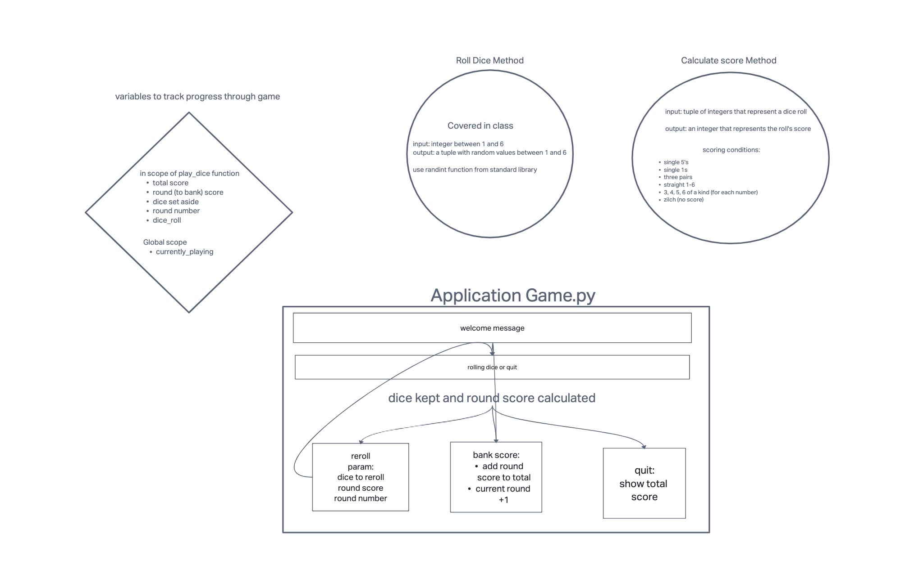
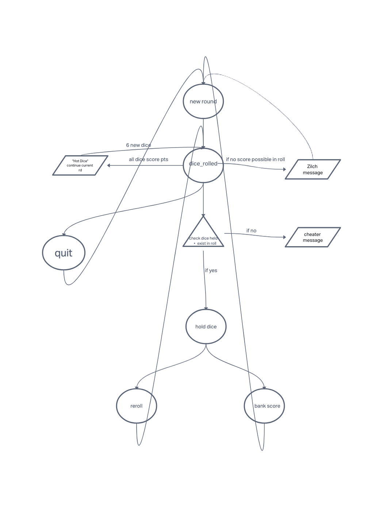

# LAB - Class 06-07-08-44

## Project: Ten-Thousand Game

### Author: Jason Christopher & Matthew Gebhart

### Links and Resources

* <http://www.playonlinedicegames.com/farkle>
* <https://en.wikipedia.org/wiki/Dice_10000>

### Whiteboard

### Setup

* `pip install pytest-watch`
* Activate Virtual Environment
* Start the game by running `python -m ten_thousand.game` in the terminal
* Run the bot by running `python -m bots` in the terminal

### Tests

* Ran pytest-watch on the given tests and customized as necessary.
